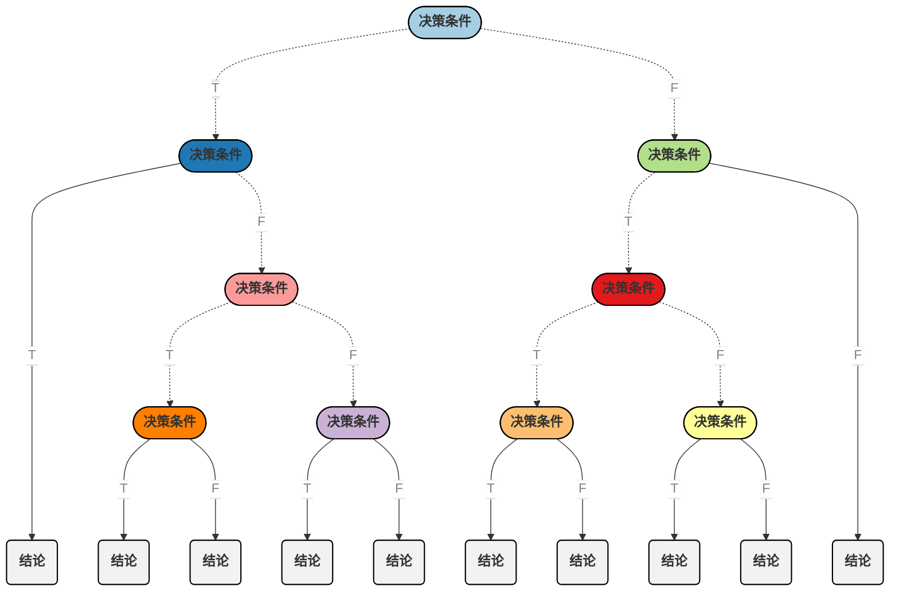

#   <center>机器学习</center>

-  -  -

-  -  -

-  -  -

### 数据集

> ###### 种类

```java
"训练集"(Training Dataset): 用于训练模型;
"测试集"(Test Dataset): 用于评估模型的效能; 
"验证集"(Validation Dataset): 用于调整超参数;
```

```java
验证集不同于训练集和测试集, 它是非必需的, 如果不需要调整超参数, 就可以不使用验证集, 直接用测试集对模型的效能进行评估; 
```

```java
验证集评估模型效能的主要目的是用来调整超参数, 通过调整超参数加强模型在验证集上的表现, 模型的效能以测试集的评估结果为准;
```

> ###### 划分方式

```java
"留出法": 按照固定比例将数据集静态的划分为训练集、验证集、测试集;
```

```java
"留一法": 共m个样本, 每次仅保留一个样本作为测试集, 其余样本作为训练集, 进行m次训练和预测(无验证集, 一般在数据缺乏时使用);
```

```java
"k折交叉验证": 将数据集分为训练集和测试集, 将训练集分为k份, 每次使用k份中的1份作为验证集, 其余的作为训练集, 通过k次训练后, 得到k个不同的模型, 评估k个模型的效果, 从中挑选最优的超参数, 使用最优的超参数, 将k份数据全部作为训练集重新训练模型, 得到最终模型;
```

> ###### 数据扩充

```java
"数据增强": 通过对原始数据进行变换, 引入一些随机性和多样性, 使训练集中的数据得到扩充;
```

```java
"数据合成": 通过模型或其他方法生成与原始数据集相似但不同的样本, 使训练集中的数据得到扩充;
```

```java
/*例*/
模拟背景: 想实现一个通过图像识别文字的模型, 但现有的数据过少，如何对训练集数据进行扩充?
数据合成: 通过计算机采用不同的字体生成一些文字, 之后通过截图或拍照的方式获得一些新的图片;
数据增强: 通过对现有的图像进行旋转 、扭曲、缩放、裁剪、亮度和对比度的调整来获得一些新的图片;
```

---

### 特征缩放

> ###### 目的

```java
提高机器学习算法的性能和稳定性, 确保各个特征在模型训练中起到合适的作用, 并且避免不同特征之间尺度差异引发的问题;
```

> ###### 常用方法

```java
标准化(Standardization): 减去特征均值并除以标准差, 将特征的值转换为均值为0, 标准差为1的分布;
```

$$
X^* = \frac{{X - \text{mean}\left(X\right)}}{{\text{std}\left(X\right)}}
$$

```java
归一化(Normalization): 减去特征最小值并除以特征最大值与以特征最小值的差值, 将特征值映射到0到1之间;
```

$$
X^* = \frac{{X - \min\left(X\right)}}{{\max\left(X\right) - \min\left(X\right)}}
$$

```java
固定范围缩放: 将特征缩放到自定义的范围, "a"和"b"是所需范围的最小值和最大值;
```

$$
X^* = a + (b - a) \cdot \frac{{X - \min\left(X\right)}}{{\max\left(X\right) - \min\left(X\right)}}
$$

> 注:

```java
为了保持模型的一致性和可靠性, 在对测试数据进行预测时, 应使用相同的训练集数据的统计量(均值、标准差等)对测试数据进行同样的特征缩放操作;
```
---

### 线性回归

> ###### 定义

```java
线性回归是一种用于建立和预测变量之间线性关系的机器学习算法, 它是最简单和最常见的回归算法之一, 用于预测连续型目标变量;
```

> ###### 模型公式

$$
\hat{y}^i = f_{\vec{w},b}\left({\vec{x}}^i\right) = \vec{w} \cdot {\vec{x}}^i + b = w_1x_1^i + w_2x_2^i + w_3x_3^i + \cdots + w_nx_n^i + b = y^i + \varepsilon^i
$$

|      成员       |                             描述                             |
| :-------------: | :----------------------------------------------------------: |
|   $\hat{y}^i$   |                  样本$i$对应因变量的预测值                   |
|      $y^i$      |                  样本$i$对应因变量的真实值                   |
|  ${\vec{x}}^i$  |       样本$i$的特征向量$\{x_1^i,x_2^i, \cdots ,x_n^i\}$        |
|  ${\vec{w}}^i$  |         特征的权重向量$\{w_1^i,w_2^i, \cdots ,w_n^i\}$         |
|       $b$       |              常数项或偏置项, 与特征无关的偏移量              |
| $\varepsilon^i$ | 样本$i$的预测误差, 即模型预测值与真实值之间的差异<br/>$\varepsilon^i$在各样本间相互独立且服从均值为$0$方差为$\sigma^2$的高斯分布(正态分布) |

>###### 概率密度函数

$$
P\left(\varepsilon^i\right) =  \frac{1}{\sqrt{2\pi\sigma^2}} \exp\left( - \frac{\left(\varepsilon^i - \mu\right)^2}{2\sigma^2}\right) = \frac{1}{\sqrt{2\pi\sigma^2}} \exp\left( - \frac{\left(\varepsilon^i\right)^2}{2\sigma^2}\right)
$$

由$\varepsilon^i = \hat{y}^i - y^i$得:
$$
P\left(y^i\vert{\vec{x}}^i;\vec{w},b\right) = \frac{1}{\sqrt{2\pi\sigma^2}}\exp\left( - \frac{\left(f_{\vec{w},b}\left({\vec{x}}^i\right) - y^i\right)^2}{2\sigma^2}\right)
$$

```java
上述边概率密度函数可以表示为在给定特征值、特征权重和偏置项得条件下, 样本i的模型预测值等于真实值的概率;
```

> ###### 似然函数

$$
L\left(\vec{w},b\right) = \prod_{i=1}^{m}{P\left(y^i\vert{\vec{x}}^i;\vec{w},b\right)} = \prod_{i=1}^{m}{\frac{1}{\sqrt{2\pi\sigma^2}} \exp\left( - \frac{\left(f_{\vec{w},b}\left({\vec{x}}^i\right) - y^i\right)^2}{2\sigma^2}\right)}
$$

```java
由于各样本之间是相互独立的, 所以线性回归的似然函数表示为各个样本概率密度函数的乘积;
```

> ###### 对数似然函数

$$
\ln{L\left(\vec{w},b\right)} = \ln{\prod_{i=1}^{m}{\frac{1}{\sqrt{2\pi\sigma^2}}\exp\left( - \frac{\left(f_{\vec{w},b}\left({\vec{x}}^i\right) - y^i\right)^2}{2\sigma^2}\right)}} = m\ln{\prod_{i=1}^{m}{\frac{1}{\sqrt{2\pi\sigma^2}}}} - \frac{1}{2\sigma^2} \cdot \sum_{i=1}^{m}{\left(f_{\vec{w},b}\left({\vec{x}}^i\right) - y^i\right)^2}
$$

```java
取对数的目的是为了将乘法转换为加法进行求解, 通过使对数似然函数最大化, 求解权重向量w和偏置项b;
```

> ###### 损失函数

$$
J\left(\vec{w},b\right) = \frac{1}{2m}\sum_{i=1}^{m}{\left(\hat{y}^i - y^i\right)^2} = \frac{1}{2m}\sum_{i=1}^{m}{\left(f_{\vec{w},b}\left({\vec{x}}^i\right) - y^i\right)^2}
$$

```java
相较于标准的均方误差损失函数, 此处除以2的目的是为了在梯度下降算法中简化计算, 用于求偏导时抵消常数系数; 
```

> ###### 求解目标

$$
\underset{\vec{w},b}{\max}L\left(\vec{w},b\right) \Rightarrow \underset{\vec{w},b}{\max}\ln{L\left(\vec{w},b\right)} \Rightarrow \underset{\vec{w},b}{\min}J\left(\vec{w},b\right)
$$

> ###### 梯度下降法求解

$$
\begin{align*}
    & \textbf{迭代$b$:} && b^* = b - \alpha\frac{\partial{J\left(\vec{w},b\right)}}{\partial b} = b - \alpha\frac{1}{m}\sum_{i=1}^{m}{\left(f_{\vec{w},b}\left({\vec{x}}^i\right) - y^i\right)} \\[10pt]
    & \textbf{迭代$w_j$:} && w_j^* = w_j - \alpha\frac{\partial{J\left(\vec{w},b\right)}}{\partial w_j} = w_j - \alpha\frac{1}{m}\sum_{i=1}^{m}{\left(f_{\vec{w},b}\left({\vec{x}}^i\right) - y^i\right)x_j^i}
\end{align*}
$$

---

### 逻辑回归

> ###### 定义

```java
逻辑回归是一种常用的机器学习算法, 用于解决二分类(分别用"0"和"1"表示)问题, 其目标是根据输入特征的线性组合来预测样本属于某个类别(由"1"表示)的概率;
```

> ###### 模型公式

$$
f_{\vec{w},b}\left({\vec{x}}^i\right) = Sigmoid\left(z^i\right) = Sigmoid\left(\vec{w} \cdot {\vec{x}}^i + b\right) = \frac{1}{1 + e^{-z^i}} = \frac{1}{1 + e^{-\left(\vec{w} \cdot {\vec{x}}^i + b\right)}} = \frac{1}{1 + e^{-\left(w_1x_1^i + w_2x_2^i + w_3x_3^i + \cdots + b\right)}}
$$

|     成员      |                      描述                       |
| :-----------: | :---------------------------------------------: |
|     $z^i$     |            样本$i$特征线性组合后的值            |
|     $y^i$     |          样本$i$对应的真实类型$0$或$1$          |
|  $\hat{y}^i$  |          样本$i$对应的预测类型$0$或$1$          |
| ${\vec{x}}^i$ | 样本$i$的特征向量$\{x_1^i,x_2^i, \cdots ,x_n^i\}$ |
| ${\vec{w}}^i$ |  特征的权重向量$\{w_1^i,w_2^i, \cdots ,w_n^i\}$   |
|      $b$      |       常数项或偏置项, 与特征无关的偏移量        |

> ###### 概率密度函数

$$
\begin{align}
    & \textbf{由:} \quad P\left(\hat{y}^i=1\vert{\vec{x}}^i;\vec{w},b\right) = f_{\vec{w},b}\left({\vec{x}}^i\right); \quad P\left(\hat{y}^i=0\vert{\vec{x}}^i;\vec{w},b\right) = 1 - f_{\vec{w},b}\left({\vec{x}}^i\right) \\[10pt]
    & \textbf{得:} \quad P\left(y^i\vert{\vec{x}}^i;\vec{w},b\right) = P\left(\hat{y}^i=1\vert{\vec{x}}^i;\vec{w},b\right)^{y^i} \cdot P\left(\hat{y}^i=0\vert{\vec{x}}^i;\vec{w},b\right)^{1-y^i} = \left(f_{\vec{w},b}\left({\vec{x}}^i\right)\right)^{y^i} \cdot \left(1-f_{\vec{w},b}\left({\vec{x}}^i\right)\right)^{1-y^i}
\end{align}
$$

```java
上述边概率密度函数可以表示为在给定特征值、特征权重和偏置项得条件下, 样本i的模型预测类型等于真实类型的概率;
```

> ###### 似然函数

$$
L\left(\vec{w},b\right) = \prod_{i=1}^{m}{P\left(y^i\vert{\vec{x}}^i;\vec{w},b\right)} = \prod_{i=1}^{m}{\left(f_{\vec{w},b}\left({\vec{x}}^i\right)\right)^{y^i} \cdot \left(1-f_{\vec{w},b}\left({\vec{x}}^i\right)\right)^{1-y^i}}
$$

```java
由于各样本之间是相互独立的, 所以逻辑回归的似然函数表示为各个样本概率密度函数的乘积;
```

> ###### 对数似然函数

$$
\ln{L\left(\vec{w},b\right)} = \ln{\prod_{i=1}^{m}{\left(f_{\vec{w},b}\left({\vec{x}}^i\right)\right)^{y^i} \cdot \left(1-f_{\vec{w},b}\left({\vec{x}}^i\right)\right)^{1-y^i}}} = \sum_{i=1}^{m}{\left(y^i \cdot \ln\left(f_{\vec{w},b}\left({\vec{x}}^i\right)\right) + (1 - y^i) \cdot \ln\left(1 - f_{\vec{w},b}\left({\vec{x}}^i\right)\right)\right)}
$$

```java
取对数的目的是为了将乘法转换为加法进行求解, 通过使对数似然函数最大化, 求解权重向量w和偏置项b;
```

> ###### 损失函数

$$
\begin{align}
    & \textbf{样本损失函数:} && J\left(\hat{y}^i,y^i\right) = J\left(f_{\vec{w},b}\left({\vec{x}}^i\right),y^i\right) = -\ln\left(P\left(\hat{y}^i=y^i\vert{\vec{x}}^i;\vec{w},b\right)\right) = 
    \begin{cases}
        -\ln\left(f_{\vec{w},b}\left({\vec{x}}^i\right)\right) & if & y^i = 1 \\[10pt]
        -\ln\left(1 - f_{\vec{w},b}\left({\vec{x}}^i\right)\right) & if & y^i = 0 
    \end{cases} \\[10pt]
    & \textbf{整体损失函数:} && J\left(\vec{w},b\right) = \frac{1}{m}\sum_{i=1}^{m}{J\left(\hat{y}^i,y^i\right)} = \frac{1}{m}\sum_{i=1}^{m}{J\left(f_{\vec{w},b}\left({\vec{x}}^i\right),y^i\right)} = -\frac{1}{m}\sum_{i=1}^{m}{\left(y^i \cdot \ln\left(f_{\vec{w},b}\left({\vec{x}}^i\right)\right) + (1 - y^i) \cdot \ln\left(1 - f_{\vec{w},b}\left({\vec{x}}^i\right)\right)\right)}
\end{align}
$$

```java
对于每个样本, 当真实标签为"0"时, 我们期望其预测的概率越小损失越小; 当真实标签为"1"时, 我们期望其预测的概率越大损失越小;
```

> ###### 求解目标

$$
\underset{\vec{w},b}{\max}L\left(\vec{w},b\right) \Rightarrow \underset{\vec{w},b}{\max}\ln{L\left(\vec{w},b\right)} \Rightarrow \underset{\vec{w},b}{\min}J\left(\vec{w},b\right)
$$

> ###### 梯度下降法求解

$$
\begin{align*}
    & \textbf{迭代$b$:} && b^* = b - \alpha\frac{\partial{J\left(\vec{w},b\right)}}{\partial b} = b - \alpha\frac{1}{m}\sum_{i=1}^{m}{\left(f_{\vec{w},b}\left({\vec{x}}^i\right) - y^i\right)} \\[10pt]
    & \textbf{迭代$w_j$:} && w_j^* = w_j - \alpha\frac{\partial{J\left(\vec{w},b\right)}}{\partial w_j} = w_j - \alpha\frac{1}{m}\sum_{i=1}^{m}{\left(f_{\vec{w},b}\left({\vec{x}}^i\right) - y^i\right)x_j^i}
\end{align*}
$$

---

### 迁移学习

> ###### 定义

```java
"迁移学习(Transfer Learning)"是一种机器学习方法, 其主要思想是通过将在一个任务(源任务)上学到的知识(模型 + 参数)应用到另一个相关任务(目标任务)上, 以提高模型在后者上的性能; 其核心假设是, 先前学到的知识可以帮助改善新任务的学习效果, 尤其是在新任务的训练数据相对较少或不够丰富时;
```

> ###### 步骤

```java
预训练: 首先在一个源任务上训练模型, 学习到与该任务相关的知识("模型"+"参数"), 源任务通常是一个大规模的任务;
```

```java
参数微调: 将预训练模型应用于目标任务的训练集数据, 将预训练模型的参数作为模型在目标任务中的初始值, 之后在目标任务中对模型进行训练, 调整模型的参数, 使其适应目标任务;
```

> ###### 限制

```java
"源任务"与"目标任务"传给"预训练模型"的数据格式应保持一致; 如果二者输入数据的格式差异较大, 在目标任务将数据传入"预训练模型"之前, 需要对数据进行额外的处理, 解决格式不一致的问题;
```

> 注:

```java
"预训练模型"不一定为"目标任务"的模型整体, 亦可以仅作为"目标任务"模型中的一部分;
```

---

### 梯度下降

> ###### 损失函数

$$
\begin{align*}
	& \textbf{均方误差(回归问题):} && J\left(\vec{w},b\right) = \frac{1}{m}\sum_{i=1}^{m}{\left(\hat{y}^i - y^i\right)^2} \\[10pt]
    & \textbf{交叉熵损失(分类问题):} && J\left(\vec{w},b\right) = -\frac{1}{m}\sum_{i=1}^{m}{\ln\left(P\left(\hat{y}^i=y^i\vert{\vec{x}}^i;\vec{w},b\right)\right)}
\end{align*}
$$

> ###### 参数迭代

```java
梯度是一个向量, 其各个分量分别表示函数在每个变量方向上的偏导数, 指向函数值增加最快的方向; 在梯度下降算法中, 我们希望沿着梯度的反方向进行参数调整, 以便逐步接近损失函数的最小值点;
```

$$
\begin{align*}
    & \textbf{迭代$b$:} && b^* = b - \alpha\frac{\partial{J\left(\vec{w},b\right)}}{\partial b} \\[10pt]
    & \textbf{迭代$w_j$:} && w_j^* = w_j - \alpha\frac{\partial{J\left(\vec{w},b\right)}}{\partial w_j}
\end{align*}
$$

```java
"ɑ"为学习率, 一个0到1之间的小数, 用于控制控制每次更新的步长; 若"ɑ"过小, 易导致迭代时移动的距离过小, 迭代过程缓慢; 若"ɑ"过大, 易导致迭代时移动的距离过大, 跨过极小值点, 远离最优解;
```

```java
如果各特征的值范围差异很大, 梯度下降可能会在一个方向上收敛得很快,但在另一个方向上收敛缓慢; 通过特征缩放可以使目标函数的等高线图更接近圆形, 使梯度下降在各个方向上更均匀地进行, 从而提高算法的收敛速度;
```

```java
当结果达到算法迭代的终止条件(达到最大迭代次数、目标函数收敛等)时, 求得的权重向量w和偏置项b为最优解; 值得注意的是, 意梯度下降算法可能会陷入局部最优解, 因此多次运行算法，每次使用不同的初始值，可以增加找到最优解的机会;
```

> ###### 常见类型

```java
"批量梯度下降": 每一次迭代都使用整个训练集数据来计算梯度和更新模型参数; 收敛稳定但速度慢, 适用于小数据集;
```

```java
"随机梯度下降": 每一次迭代只使用一个训练集样本(随机)来计算梯度和更新模型参数; 更新快但不稳定，适用于大数据集;
```

```java
"小批量梯度下降": 每一次迭代使用一小部分(小批量)训练集样本来计算梯度和更新模型参数; 折衷了效率和稳定性，是最常用的梯度下降方法;
```

> ###### Adam梯度下降优化算法

```java
Adam(Adaptive Moment Estimation)是一种用于优化梯度下降的算法, 它结合了动量法和自适应学习率的思想, 旨在加速收敛并提高性能; 
```

```java
简单来说, 当Adam发现迭代过程稳步的接近极小值点但是过程比较缓慢时, 其可以通过增加学习率"ɑ"的值提高其迭代的速度; 当Adam发现迭代过程不断的跨越并远离极小值点时, 其可以通过减小学习率"ɑ"的值使其向极小值点的方向迭代;
```

---

### 过(欠)拟合

> ###### 定义

```java
"过拟合"指的是模型在训练集上表现很好, 在验证集或测试集上表现不佳的情况;
"欠拟合"指模型无法在训练集上获得足够好的拟合, 在训练集上表现不佳的情况;
```

> ###### 偏差与方差

```java
"偏差(Bias)"一般是针对训练集, 体现的是模型对于训练集数据的表现能力;
"方差(Variance)"一般是针对测试集, 体现的是模型对于测试集数据的表现能力;
```

$$
\begin{align*}
    & \textbf{高偏差:} && J_{Validation}\left(\vec{w},b\right) \approx J_{Training}\left(\vec{w},b\right) \gg J_{Baseline} \\[10pt]
    & \textbf{高方差:} && J_{Validation}\left(\vec{w},b\right) \gg J_{Training}\left(\vec{w},b\right) \approx J_{Baseline} \\[10pt]
    & \textbf{高偏差高方差:} && J_{Validation}\left(\vec{w},b\right) \gg J_{Training}\left(\vec{w},b\right) \gg J_{Baseline} \\[10pt]
    & \textbf{期望偏差方差:} && J_{Validation}\left(\vec{w},b\right) \approx J_{Training}\left(\vec{w},b\right) \approx J_{Baseline}
\end{align*}
$$

```java
"高偏差"一般是由于模型欠拟合所导致的, 即模型对训练集和验证集的数据均表现不佳;
"高方差"一般是由于模型过拟合所导致的, 模型对训练集的数据表现很好, 但对验证集或测试集的数据表现不佳;
```

> ###### 解决方案

```java
对于过拟合(高方差)的情况, 主体思想是要降低模型的复杂度(还要考虑是否是训练集数据量过少而导致的);
对于欠拟合(高偏差)的情况, 主题思想是要增加模型的复杂度, 赋予模型更高的灵活性, 使其能够更好地适应训练集数据;
```

> ###### L1、L2正则化

$$
\begin{align*}
    & \textbf{L1正则化惩罚项:} && \lambda\sum_{i=1}^{n}{\left|w_i\right|} \\[10pt]
    & \textbf{L1正则化损失函数:} && {J\left(\vec{w},b\right)}^* = J\left(\vec{w},b\right) + \frac{\lambda}{2m}\sum_{i=1}^{n}{\left|w_i\right|} \\[10pt]
    & \textbf{L2正则化惩罚项:} && \lambda\sum_{i=1}^{n}{w_i^2} \\[10pt]
    & \textbf{L2正则化损失函数:} && {J\left(\vec{w},b\right)}^* = J\left(\vec{w},b\right) + \frac{\lambda}{2m}\sum_{i=1}^{n}{w_i^2}
\end{align*}
$$

```java
"λ"是正则化参数, 决定了正则化的强度; 正则化通过对模型的参数进行惩罚, 防止参数取值过大, 从而限制模型的复杂度;
```

> ###### 求解目标

$$
\underset{\vec{w},b}{\min}J\left(\vec{w},b\right) \Rightarrow \underset{\vec{w},b}{\min}{J\left(\vec{w},b\right)}^*
$$

> ###### 梯度下降法迭代

$$
\begin{align*}
	& \textbf{迭代$b$:} && b^* = b - \alpha\frac{\partial{{J\left(\vec{w},b\right)}^*}}{\partial b} = b - \alpha\frac{\partial{J\left(\vec{w},b\right)}}{\partial b} \\[10pt]
    & \textbf{迭代$w_j$:} && w_j^* = w_j - \alpha\frac{\partial{{J\left(\vec{w},b\right)}^*}}{\partial w_j} = w_j - \alpha\left(\frac{\partial{J\left(\vec{w},b\right)}}{\partial w_j} + \frac{\lambda}{m}{w_j}\right)
\end{align*}
$$

```java
较大的λ值会增强正则化的效果, 使模型的权重参数趋向于较小的值; 较小的λ值会减弱正则化的效果; 允许模型权重参数取较大的值; 如果λ值过大, 会强制模型的权重参数趋向于0, 限制模型的复杂度, 使模型变得过于简单, 无法充分拟合数据, 导致欠拟合现象;
```

---

### 神经元网络

> ###### 定义

```java
"神经元网络"是一种模拟人脑神经系统的计算模型; 它由大量相互连接的基本处理单元(神经元)组成, 通过这些神经元之间的连接和信息传递来实现复杂的计算任务; 神经元网络通常由多个层次组成, 包括输入层、隐藏层和输出层, 输入信号在隐藏层中经过每一层的神经元计算, 通过加权求和以及非线性激活函数转换产生新的特征, 这些新的特征被传递到下一层作为输入, 进一步进行计算和转换, 直到最后由输出层生成最终的计算结果;
```

```java
注: 激活函数的作用是对加权求和后的结果进行非线性转换, 引入非线性特性, 使神经网络可以学习和表示更加复杂的函数关系;
```

> ###### 图形展示


> ###### 公式展示

$$
\begin{align*}
    & \textbf{输入层:} && {\vec{x}}^i \\[10pt]
    & \textbf{隐藏层($1$):} && y_{1,1}^i = f_{{\vec{w}_{11}},b_{11}}\left({\vec{x}}^i\right); && y_{1,2}^i = f_{{\vec{w}_{12}},b_{12}}\left({\vec{x}}^i\right); && \cdots ; && y_{1,j}^i = f_{{\vec{w}_{1j}},b_{1j}}\left({\vec{x}}^i\right); && \cdots ; \\[10pt]
    & \textbf{隐藏层($2$):} && y_{2,1}^i = f_{{\vec{w}_{21}},b_{21}}\left({\vec{y}}_1^i\right); && y_{2,2}^i = f_{{\vec{w}_{22}},b_{22}}\left({\vec{y}}_1^i\right); && \cdots ; && y_{2,j}^i = f_{{\vec{w}_{2j}},b_{2j}}\left({\vec{y}}_1^i\right); && \cdots ; \\[10pt]
    & && \quad\quad\vdots && \quad\quad\vdots && \cdots ; && \quad\quad\vdots && \cdots ; \\[10pt]
    & \textbf{隐藏层($l$):} && y_{l,1}^i = f_{{\vec{w}_{l1}},b_{l1}}\left({\vec{y}}_{l-1}^i\right); && y_{l,2}^i = f_{{\vec{w}_{l2}},b_{l2}}\left({\vec{y}}_{l-1}^i\right); && \cdots ; && y_{l,j}^i = f_{{\vec{w}_{lj}},b_{lj}}\left({\vec{y}}_{l-1}^i\right); && \cdots ; \\[10pt]
    & \textbf{输出层:} && \hat{y}^i = f_{\vec{w},b}\left({\vec{y}}_l^i\right) \\[10pt]
\end{align*}
$$

|            成员             |                             描述                             |
| :-------------------------: | :----------------------------------------------------------: |
|         $y_{k,j}^i$         |        样本$i$在隐藏层$k$的第$j$个神经元中的输出结果         |
|       ${\vec{y}}_k^i$       |    样本$i$在隐藏层k$中所有神经元中的输出结果所组成的向量     |
| $f_{{\vec{w}_{kj}},b_{kj}}$ | 隐藏层$k$的第$j$个神经元对应的激活函数(以上一层的结果${\vec{y}}_{k-1}^i$作为输入) |
|       $f_{\vec{w},b}$       | 输出层对应神经元的激活函数(对于回归问题, 直接输出加权求和后结果, 不需要通过激活函数进行额外的转换) |

> ###### 常用激活函数

$$
\textbf{ReLU函数:} \quad f_{{\vec{w}_{kj}},b_{kj}}\left({\vec{y}}_{k-1}^i\right) = \max\left(0, {\vec{w}_{kj}} \cdot {\vec{y}}_{k-1}^i + b_{kj}\right)
$$

```java
特点: 对于正值输入, 梯度为1, 避免了梯度消失问题; 但对于负值输入, 梯度为0, 导致神经元无法更新, 可能导致某些神经元的死亡;
```

$$
\textbf{双曲正切(Tanh)函数:} \quad f_{{\vec{w}_{kj}},b_{kj}}\left({\vec{y}}_{k-1}^i\right) = \frac{e^{\left({\vec{w}_{kj}} \cdot {\vec{y}}_{k-1}^i + b_{kj}\right)} - e^{-\left({\vec{w}_{kj}} \cdot {\vec{y}}_{k-1}^i + b_{kj}\right)}}{e^{\left({\vec{w}_{kj}} \cdot {\vec{y}}_{k-1}^i + b_{kj}\right)} + e^{-\left({\vec{w}_{kj}} \cdot {\vec{y}}_{k-1}^i + b_{kj}\right)}}
$$

```java
特点: 输出范围为(-1, 1), 对于对称性的数据有更好的表达能力; 但存在梯度消失问题, 当输入非常大或非常小时, 梯度接近于0;
```

$$
\textbf{Leaky ReLU函数:} \quad f_{{\vec{w}_{kj}},b_{kj}}\left({\vec{y}}_{k-1}^i\right) = 
    \begin{cases}
        {\vec{w}_{kj}} \cdot {\vec{y}}_{k-1}^i + b_{kj} & if & {\vec{w}_{kj}} \cdot {\vec{y}}_{k-1}^i + b_{kj} > 0 \\[10pt]
        \alpha\left({\vec{w}_{kj}} \cdot {\vec{y}}_{k-1}^i + b_{kj}\right) & if & {\vec{w}_{kj}} \cdot {\vec{y}}_{k-1}^i + b_{kj} \le 0
    \end{cases}
$$

```java
特点: 解决了ReLU函数负输入时梯度为0的问题, 避免了神经元死亡问题; 但需要设置超参数是α, 需要进行额外的计算;
```

$$
\textbf{Sigmoid函数:} \quad f_{\vec{w},b}\left({\vec{y}}_{k-1}^i\right) = \frac{1}{1 + e^{-\left({\vec{w}_{kj}} \cdot {\vec{y}}_{k-1}^i + b_{kj}\right)}}
$$

```java
特点: 输出范围为(0, 1)，可以用于二分类问题的概率表示, 常用于二分类问题的输出层激活函数; 但存在梯度消失问题, 当输入非常大或非常小时, 梯度接近于0;
```

$$
\textbf{Softmax函数:} \quad f_{{\vec{w}_{kj}},b_{kj}}\left({\vec{y}}_{k-1}^i\right) =  \frac{e^{\left({\vec{w}_{kj}} \cdot {\vec{y}}_{k-1}^i + b_{kj}\right)}}{\sum_{j=1}^{n}{e^{\left({\vec{w}_{kj}} \cdot {\vec{y}}_{k-1}^i + b_{kj}\right)}}}
$$

```java
特点: 输出范围为(0, 1)，可将输入转化为表示类别的概率表示, 保持了概率的归一化性质, 常用于多分类问题的输出层激活函数; 但对于较大的输入值, 指数运算可能导致数值不稳定;
```

> ###### 卷积层与池化层

```java
"卷积层": 通过在输入数据(矩阵)上滑动一个卷积核(一般为一个n×n的加权方阵, n一般为奇数), 对卷积核覆盖到的区域行加权求和, 以一定的步幅(大于等于1且小于等于n)移动卷积核, 重复加权求和操作, 达到提取输入数据局部特征的作用, 有助于减少参数数量，提高模型的计算效率;
```

```java
"池化层": 通过在输入数据(矩阵)上滑动一个窗口(一般为一个m×m的无权方阵), 从窗口的覆盖区域进行采样, 以一定的步幅(一般等于m)移动窗口, 重复采样操作, 达到减小输入数据空间维度的同时保留重要信息的作用; 常用的池化方法由"最大池化"(选择局部区域中最大值)和"平均池化"(计算局部区域的平均值);
```

```java
/*卷积层如何达到减少参数数量的作用*/
假设有一个4×4的矩阵, 我们通过一个2×2的卷积核, 以1为步幅进行移动, 最终可以提取到一个3×3的特征矩阵(9个特征), 如果我们想通过神经元网络的全连接层来输出9个特征, 则需要训练"16×9=144"个参数, 而使用卷积层只需要训练卷积核中的"2×2=4"个参数; 因此, 卷积层实际上是神经元网络中的一个"局部连接层", 且其中各神经元之间"参数共享";
```

> ###### 例(识别手写数字):

```python
import tensorflow

# 1.数据准备
# 加载MNIST数据集(每张图片为一张28*28像素的手写数字)并拆分为训练集和测试集
(train_images, train_labels), (test_images, test_labels) = tensorflow.keras.datasets.mnist.load_data()
# 将图像像素值缩放到0到1之间
train_images = train_images / 255.0
test_images = test_images / 255.0
# 将标签转换为独热编码(一个0、1矩阵, 行表示样本, 列表示类别)
train_labels = tensorflow.keras.utils.to_categorical(train_labels, num_classes=10)
test_labels = tensorflow.keras.utils.to_categorical(test_labels, num_classes=10)

# 2.构建模型
model = tensorflow.keras.models.Sequential()
model.add(tensorflow.keras.layers.Flatten(input_shape=(28, 28))) # 输入层: 将二维图像展平为一维向量(按行拼接)
model.add(tensorflow.keras.layers.Dense(256, activation='relu')) # 隐藏层【1】: 包含256个神经元, 激活函数选用"ReLU函数"
model.add(tensorflow.keras.layers.Dense(128, activation='relu')) # 隐藏层【2】: 包含128个神经元, 激活函数选用"ReLU函数"
model.add(tensorflow.keras.layers.Dense(10, activation='softmax')) # 输出层: 包含10个神经元(代表0-9共10个类别), 激活函数选用"Softmax函数"

# 3.编译模型
model.compile(optimizer="adam", loss="categorical_crossentropy", metrics=["accuracy"]) # 此处损失函数采用"categorical_crossentropy"的原因是因为我们之前对标签进行了独热编码; 如果先前未进行独热编码转换, 可以使用"sparse_categorical_crossentropy"

# 4.训练模型
model.fit(train_images, train_labels, epochs=10, batch_size=32, verbose=1) # "epochs"用于指定对模型进行迭代优化的次数, "batch_size"用于指定进行小批量梯度下降时抽取的样本个数

# 5.评估模型
test_loss, test_accuracy = model.evaluate(test_images, test_labels, verbose=0)
print('Test Loss:', test_loss)
print('Test Accuracy:', test_accuracy)

# 6.模型应用
# 假设new_images是一组新的数据集(每张图片为一张28*28像素的手写数字)
new_images = new_images / 255.0 # 将图像像素值缩放到0到1之间
prediction = model.predict(new_images) # 预测每个样本为"0-9"共10个类别的概率(行为样本列为类别)
```

---

### 决策树模型

> ###### 定义

```java
"决策树"是一种机器学习模型, 模拟了决策过程的树状结构; 通过一系列的问题和条件来对数据进行分类或回归, 从根节点开始, 根据特征逐步分支直至达到叶节点, 每个叶节点代表一个决策结果;
```

> ###### 图形展示



> ###### 方差(回归问题)

$$
\begin{align*}
    & \textbf{方差:} && Var\left(N\right) = \frac{1}{n_N} \cdot \sum_{i=1}^{n_N}{y_i-\bar{y}} \\[10pt]
    & \textbf{方差变化量:} && \Delta Var\left(N\right) = Var\left(N\right) - \left(\frac{n_{c1}}{n_N}Var\left(N_{c1}\right) + \frac{n_{c2}}{n_N}Var\left(N_{c2}\right)\right)
\end{align*}
$$

|            成员            |                             描述                             |
| :------------------------: | :----------------------------------------------------------: |
|           $y_i$            |                    样本$i$对应的因变量值                     |
|         $\bar{y}$          |                节点$N$中所有样本因变量的均值                 |
|    $Var\left(N\right)$     |  节点$N$的方差，值越小说明该节点中样本因变量的离散程度越小   |
|  $N$、$N_{c1}$、$N_{c2}$   |       分别表示节点$N$及其两个子节点$N_{c1}$、$N_{c2}$        |
| $n_N$、$n_{c1}$、$n_{c2}$  |          分别表示节点$N$及其两个子节点上的样本数目           |
| $\Delta Var\left(N\right)$ | 节点$N$的方差变化量, 该值越大说明子节点的离散程度越小, 决策条件选择的越好 |

> ###### 信息熵（分类问题）

$$
\begin{align*}
    & \textbf{信息熵:} && H\left(N\right) = -\sum_{i=1}^{k}{p_i \cdot \log_{2}{p_i}} \\[10pt]
    & \textbf{信息增益:} && Gain\left(N\right) = H\left(N\right) - \left(\frac{n_{c1}}{n_N}H\left(N_{c1}\right) + \frac{n_{c2}}{n_N}H\left(N_{c2}\right)\right)
\end{align*}
$$

|           成员            |                             描述                             |
| :-----------------------: | :----------------------------------------------------------: |
|            $k$            |                       要分类的类别数目                       |
|           $p_i$           |                类别$i$在节点$N$处的出现的概率                |
|     $H\left(N\right)$     |         节点$N$的信息熵，值越小说明该节点的纯度越高          |
|  $N$、$N_{c1}$、$N_{c2}$  |       分别表示节点$N$及其两个子节点$N_{c1}$、$N_{c2}$        |
| $n_N$、$n_{c1}$、$n_{c2}$ |          分别表示节点$N$及其两个子节点上的样本数目           |
|   $Gain\left(N\right)$    | 节点$N$的信息增益, 该值越大说明子节点的纯度越高, 决策条件选择的越好 |

> ###### 基尼系数(分类问题)

$$
\begin{align*}
    & \textbf{基尼系数:} && Gini\left(N\right) = \sum_{i=1}^{k}{p_i\left(1-p_i\right)} = 1 - \sum_{i=1}^{k}{p_i^2} \\[10pt]
    & \textbf{基尼系数变化量:} && \Delta Gini\left(N\right) = Gini\left(N\right) - \left(\frac{n_{c1}}{n_N}Gini\left(N_{c1}\right) + \frac{n_{c2}}{n_N}Gini\left(N_{c2}\right)\right)
\end{align*}
$$

|            成员             |                             描述                             |
| :-------------------------: | :----------------------------------------------------------: |
|             $k$             |                       要分类的类别数目                       |
|            $p_i$            |                类别$i$在节点$N$处的出现的概率                |
|    $Gini\left(N\right)$     |        节点$N$的基尼系数，值越小说明该节点的纯度越高         |
|   $N$、$N_{c1}$、$N_{c2}$   |       分别表示节点$N$及其两个子节点$N_{c1}$、$N_{c2}$        |
|  $n_N$、$n_{c1}$、$n_{c2}$  |          分别表示节点$N$及其两个子节点上的样本数目           |
| $\Delta Gini\left(N\right)$ | 节点$N$的基尼系数变化量, 该值越大说明子节点的纯度越高, 决策条件选择的越好 |

> ###### 构建过程

```java
1. 遍历所有可能的决策条件, 根据选择的决策条件将数据集划分到子节点, 比较各决策条件的决策度量(方差变化量、信息增益或基尼系数变化量), 为当前节点选取最优的决策条件;
2. 对各子节点重复步骤1的操作, 直至当前节点达到终止条件: 
		a. 当前节点的纯度达到阈值
		b. 继续分裂节点会超出最大深度限制
		c. 继续分裂节点产生的信息增益小于规定阈值
		···
3. 将满足终止条件的节点转化为叶子节点, 并为叶子节点分配一个数值(节点中各样本数值的均值)或类别标签(节点中包含数目最多的类别);
4. 构建完整的决策树后, 可以考虑根据一定的标准对树进行剪枝(删除树中的某些节点及其子节点), 以达到防止过拟合、提高模型泛化性能的目的;
```

> ###### 随机森林

```java
随机森林是一种集成学习算法, 通过构建多个决策树来进行预测, 然后通过"投票"(分类问题)或"取均值"(回归问题)来获得最终的预测结果;
```

```java
注: 随机森林中每棵决策树构建时所使用的数据集是通过"自助采样"(有放回抽样)获取的与原训练集大小一致的样本子集; 并且为了提高树之间的多样性，在进行节点分裂时, 会从所有可用的决策条件中随机抽取一部分决策条件(抽取的数量一般为当前可用决策条件数目的平方根), 从中选择最优的决策条件;
```

---

### 模型效能评估

> ###### 回归问题

$$
\begin{align*}
    & \textbf{R平方:} && R^2 = \frac{\sum_{i=1}^{m}{\left(\hat{y}^i - y^i\right)^2}}{\sum_{i=1}^{m}{\left(y^i - \bar{y}\right)^2}} \\[10pt]
    & \textbf{平均绝对误差:} && MAE = \frac{1}{m}\sum_{i=1}^{m}{\left|\hat{y}^i - y^i\right|} \\[10pt]
    & \textbf{均方误差:} && MSE = \frac{1}{m}\sum_{i=1}^{m}{\left(\hat{y}^i - y^i\right)^2} \\[10pt]
    & \textbf{均方根误差:} && RMSE = \sqrt{MSE}  = \sqrt{\frac{1}{m}\sum_{i=1}^{m}{\left(\hat{y}^i - y^i\right)^2}}
\end{align*}
$$

```java
R平方衡量了模型解释方差的能力, 取值范围在0到1之间, 越大表示模型拟合得越好;
```

```java
平均绝对误差(MAE)、均方误差(MSE)和均方根误差(RMSE)都表示的是预测值与实际值之间误差, 均为越小越好; 但与均方误差(MSE)和均方根误差(RMSE)相比, 平均绝对误差(MAE)对异常值(大误差)的敏感性较低;
```

> ###### 二分类问题

> > ###### 混淆矩阵

|         -          |              真实类别A【1】              |              真实类别B【0】              |
| :----------------: | :--------------------------------------: | :--------------------------------------: |
| **预测类别A【1】** | $\textit{TP} \\ \textit{True Positive}$  | $\textit{FP} \\ \textit{False Negative}$ |
| **预测类别B【0】** | $\textit{FN} \\ \textit{False Negative}$ | $\textit{TN} \\ \textit{True Negative}$  |

> > ###### 效能指标

$$
\begin{align*}
    & \textbf{召回率:} && Recall = \frac{TP}{TP + FN} \\[10pt]
    & \textbf{精准度:} && Precision = \frac{TP}{TP + FP} \\[10pt]
    & \textbf{F1得分:} && \textit{F1-score} = \frac{2 \times Recall \times Precision}{Recall + Precision}
\end{align*}
$$

```java
召回率(Recall)侧重于评估在所有的A类数据中, 有多少数据被成功预测为A类;
精准度(Precision)侧重于评估被在预测为A类的所有数据中, 真实类型为A类的数据占多少;
```

```java
/*例*/
假设医院开发一套癌症诊断模型, 用于判断病人是(A)否(B)患癌: 召回率(Recall)回答的问题是在一堆癌症患者中有多少人能被成功检测出来; 精准度(Precision)回答的问题是在被诊断为癌症患者的一堆人中有多少人真得了癌症; 并且, 对于这个示例, FN是指得了癌症的病人没有被诊断出癌症的情况, 这种情况是最应该避免的, 我们宁可把健康人误诊为癌症(FP)，也不能让真正患病的人检测不出癌症(FN)而耽误治疗离世, 所以这个模型应该更加注重提高Recall值;
```

> ###### 多分类问题

> > ###### 混淆矩阵

|       -       |  真实类别A  |  真实类别B  |  真实类别C  | $\cdots$  |
| :-----------: | :---------: | :---------: | :---------: | :-------: |
| **预测类别A** |   $TP_A$    | $FP_A,FN_B$ | $FP_A,FN_C$ | $\cdots$  |
| **预测类别B** | $FN_A,FP_B$ |   $TP_B$    | $FP_B,FN_C$ | $\cdots$  |
| **预测类别C** | $FN_A,FP_C$ | $FN_B,FP_C$ |   $TP_C$    | $\cdots$  |
|   $ \vdots$   |  $ \vdots$  |  $ \vdots$  |  $ \vdots$  | $ \vdots$ |

> > ###### 效能指标

$$
\begin{align*}
    & \textbf{类别召回率:} && Recall_i = \frac{TP_i}{TP_i + FN_i} \\[10pt]
    & \textbf{类别精准度:} && Precision_i = \frac{TP_i}{TP_i + FP_i} \\[10pt]
    & \textbf{宏平均召回率:} && \textit{Macro-Recall} = \frac{\sum_{i=1}^{N}{Recall_i}}{N} \\[10pt]
    & \textbf{宏平均精准度:} && \textit{Macro-Precision} = \frac{\sum_{i=1}^{N}{Precision_i}}{N} \\[10pt]
    & \textbf{宏平均F1得分:} && \textit{Macro-F1-score} = \frac{2 \times \textit{Macro-Recall}  \times \textit{Macro-Precision}}{\textit{Macro-Recall} + \textit{Macro-Precision}} \\[10pt]
    & \textbf{加权平均召回率:} && \textit{Weighted-Recall} = \sum_{i=1}^{N}{Recall_i \cdot Weight_i}; \quad Weight_i=\frac{n_i}{n_{all}} \\[10pt]
    & \textbf{加权平均精准度:} && \textit{Weighted-Precision} = \sum_{i=1}^{N}{Precision_i \cdot Weight_i}; \quad Weight_i=\frac{n_i}{n_{all}} \\[10pt]
    & \textbf{加权平均F1得分:} && \textit{Weighted-F1-score} = \frac{2 \times \textit{Weighted-Recall}  \times \textit{Weighted-Precision}}{\textit{Weighted-Recall} + \textit{Weighted-Precision}}
\end{align*}
$$

```java
 宏平均对每个类别平等看待, 不考虑样本数量, 每个类别的贡献相同; 加权平均考虑了样本数量, 样本数量多的类别对整体性能指标的影响更大;
```

---

### K-Means聚类

> ###### 步骤

```java
1. 初始化簇中心: 随机选择K个样本作为初始的簇中心;
2. 样本分配: 对于每个样本, 计算它与每个簇中心的距离, 并将其分配到最近的簇中心;
3. 更新簇中心: 对于每个簇, 计算其中心点(簇内样本平均值)，并将该中心点作为新的簇中心;
4. 迭代: 重复执行样本分配和更新簇中心的操作, 直到簇中心不再发生显著变化或达到规定的迭代次数;
```

```java
注: K-Means对初始簇中心的选择非常敏感, 不同的初始值可能导致不同的聚类结果; 为了减轻这一影响, 通常会多次运行K-Means算法, 每次使用不同的初始化簇中心, 最终选择损失函数值最小的聚类结果;
```

> ###### 损失函数

$$
J\left(\vec{c},\vec{\mu}\right)  = \frac{1}{m}\sum_{i=1}^{m}{{\left\|x_i-\mu_{c_{x_i}}\right\|}^2}
$$

|                成员                |            描述             |
| :--------------------------------: | :-------------------------: |
|               $x_i$                |           样本$i$           |
|             $c_{x_i}$              |        样本$i$所在簇        |
|          $\mu_{c_{x_i}}$           |    样本$i$所在簇的簇中心    |
| $\left\|x_i-\mu_{c_{x_i}}\right\|$ | 样本$i$到所在簇簇中心的距离 |

> ###### 最佳聚类数目

> > ###### 肘部法则

```java
对不同聚类数目进行聚类分析, 然后绘制聚类数目与聚类性能(如损失函数)的关系折线图, 在图中找到一个明显的"肘部", 肘部对应的聚类数目就是最佳聚类数目, 肘部处的点表示继续增加聚类数目, 性能提升减缓;
```


> > ###### 轮廓系数

$$
\begin{align*}
    & \textbf{样本轮廓系数:} && SC_{x_i} = \frac{b_{x_i} - a_{x_i}}{\max\left(a_{x_i},b_{x_i}\right)}  \\[10pt]
    & \textbf{整体轮廓系数:} && SC = \frac{1}{m}\sum_{i=1}^{m}{SC_{x_i}} = \frac{1}{m}\sum_{i=1}^{m}{\frac{b_{x_i} - a_{x_i}}{\max{\left(a_{x_i},b_{x_i}\right )}}}
\end{align*}
$$

|   成员    |                             描述                             |
| :-------: | :----------------------------------------------------------: |
| $a_{x_i}$ |           样本$i$与其所在簇内其他样本间距离的均值            |
| $b_{x_i}$ | 样本$i$与其非所在簇内样本间距离的最小均值(每个簇单独计算一个均值) |

```java
对不同聚类数目进行聚类分析, 选取整体轮廓系数最大的聚类数目作为最佳聚类数目; 轮廓系数衡量了簇内样本的相似程度, 以及不同簇之间的分离程度;
```

---

### 异常检测算法

